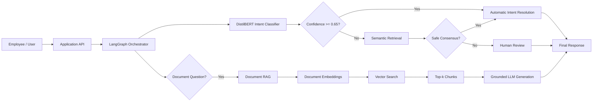

# High-Level Architecture

```mermaid
flowchart LR
    U[Employee / User] --> API[Application API]
    API --> LG[LangGraph Orchestrator]
    LG --> CLS[DistilBERT Intent Classifier]
    CLS --> CONF{Confidence >= 0.65?}
    CONF -->|Yes| AUTO[Automatic Intent Resolution]
    CONF -->|No| SR[Semantic Retrieval]
    SR --> CONS{Safe Consensus?}
    CONS -->|Yes| AUTO
    CONS -->|No| HUMAN[Human Review]
    LG --> DOC{Document Question?}
    DOC -->|Yes| RAG[Document RAG]
    RAG --> EMB[Document Embeddings]
    EMB --> VDB[Vector Search]
    VDB --> CHUNKS[Top-k Chunks]
    CHUNKS --> LLM[Grounded LLM Generation]
    AUTO --> RESP[Final Response]
    HUMAN --> RESP
    LLM --> RESP
```