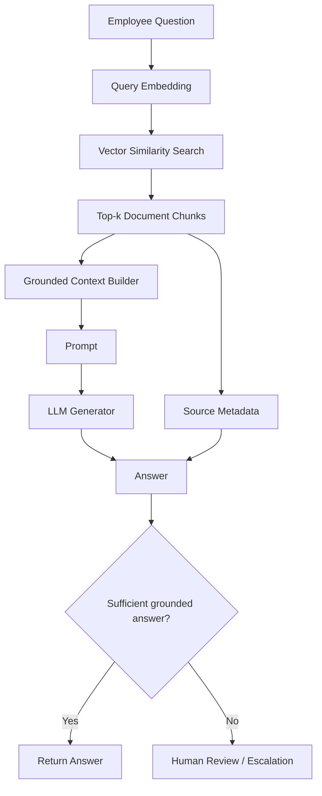

# Document RAG Flow

```mermaid
flowchart TD
    Q[Employee Question] --> QE[Query Embedding]
    QE --> SEARCH[Vector Similarity Search]
    SEARCH --> TOPK[Top-k Document Chunks]
    TOPK --> CTX[Grounded Context Builder]
    CTX --> PROMPT[Prompt]
    PROMPT --> LLM[LLM Generator]
    LLM --> ANSWER[Answer]
    TOPK --> SOURCES[Source Metadata]
    SOURCES --> ANSWER
    ANSWER --> CHECK{Sufficient grounded answer?}
    CHECK -->|Yes| FINAL[Return Answer]
    CHECK -->|No| HUMAN[Human Review / Escalation]
```