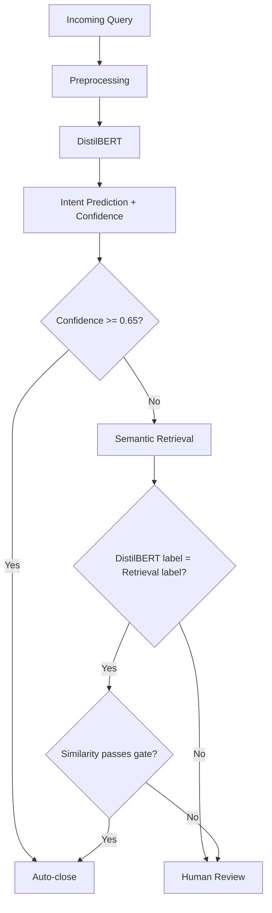

# Intent Classification Flow

```mermaid
flowchart TD
    Q[Incoming Query] --> PRE[Preprocessing]
    PRE --> DB[DistilBERT]
    DB --> P[Intent Prediction + Confidence]
    P --> G{Confidence >= 0.65?}
    G -->|Yes| CLOSE[Auto-close]
    G -->|No| RET[Semantic Retrieval]
    RET --> AGREE{DistilBERT label = Retrieval label?}
    AGREE -->|No| REVIEW[Human Review]
    AGREE -->|Yes| SIM{Similarity passes gate?}
    SIM -->|Yes| CLOSE
    SIM -->|No| REVIEW
```

В финальном эксперименте similarity gate был выбран как 1.0,
поэтому low-confidence consensus не дал дополнительной безопасной coverage.