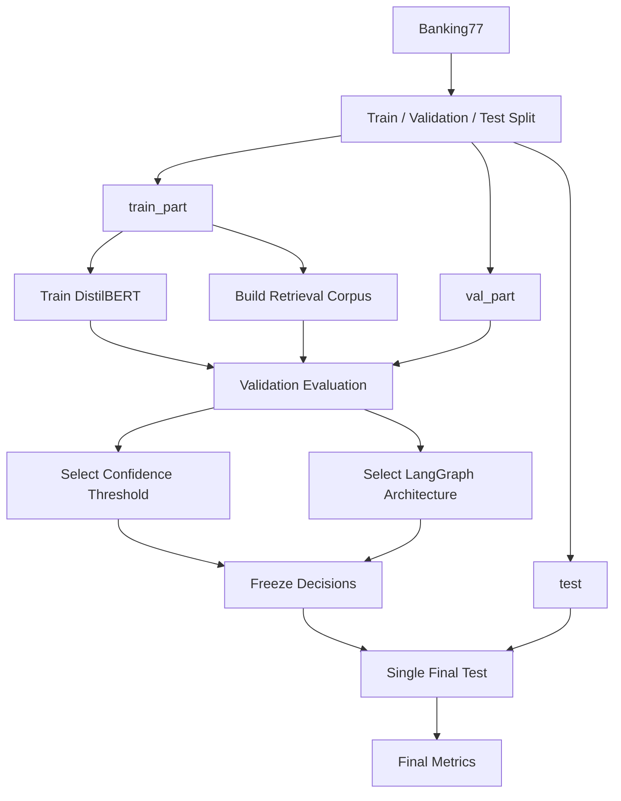

# Training and Evaluation Flow

```mermaid
flowchart TD
    DATA[Banking77] --> SPLIT[Train / Validation / Test Split]
    SPLIT --> TRAIN[train_part]
    SPLIT --> VAL[val_part]
    SPLIT --> TEST[test]
    TRAIN --> DBTRAIN[Train DistilBERT]
    TRAIN --> RETCORPUS[Build Retrieval Corpus]
    DBTRAIN --> VALEVAL[Validation Evaluation]
    RETCORPUS --> VALEVAL
    VAL --> VALEVAL
    VALEVAL --> THRESH[Select Confidence Threshold]
    VALEVAL --> ARCH[Select LangGraph Architecture]
    THRESH --> FREEZE[Freeze Decisions]
    ARCH --> FREEZE
    FREEZE --> FINALTEST[Single Final Test]
    TEST --> FINALTEST
    FINALTEST --> METRICS[Final Metrics]
```

Методологическое правило:
test используется только после выбора всех параметров на validation.